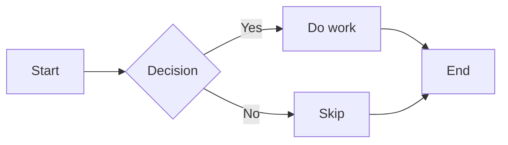
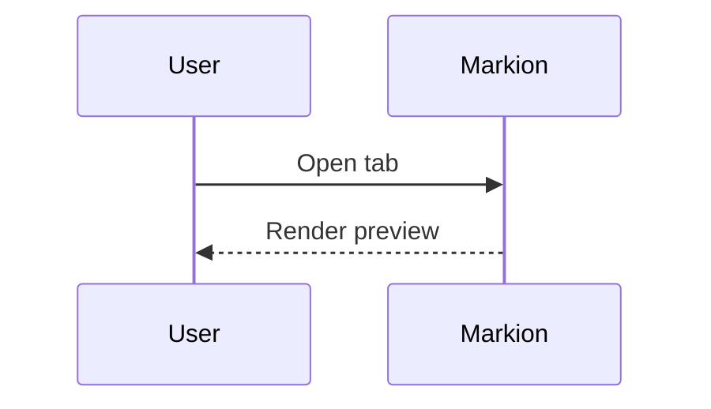

# Diagram fixture

```mermaid
flowchart LR
  A[Start] --> B{Decision}
  B -->|Yes| C[Do work]
  B -->|No| D[Skip]
  C --> E[End]
  D --> E
```

A paragraph between diagrams.

```mermaid
sequenceDiagram
  participant User
  participant Markion
  User->>Markion: Open tab
  Markion-->>User: Render preview
```
